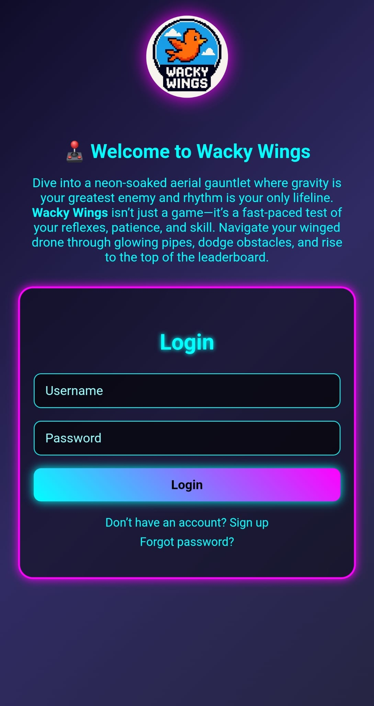
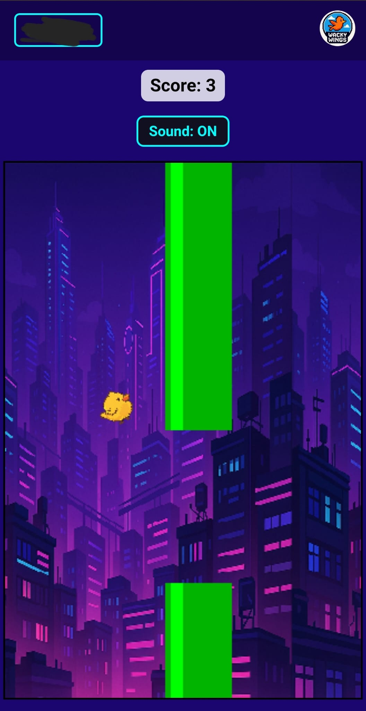
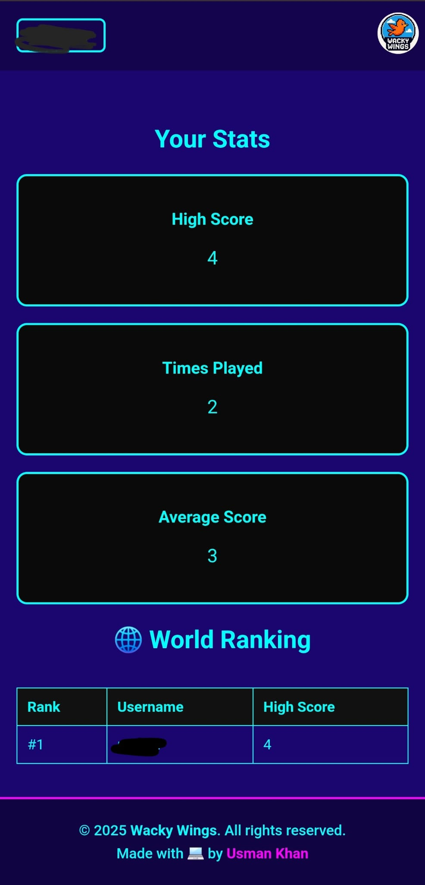

# 🐔 Wacky Wings

[Play the Game Here 🎮](https://wacky-wings.netlify.app)

Wacky Wings is a hilarious and addictive side-scrolling flying game where you control a goofy bird navigating through pipe-like obstacles. Built with HTML, CSS, JavaScript, and Firebase, the game tracks your high score, supports mobile devices, and features quirky sound effects for an engaging gameplay experience.

## 🚀 Features

- **📱 Fully Responsive Gameplay Across Devices**  
  The game adapts seamlessly to both desktop and mobile environments. Optimized UI and physics ensure consistent gameplay, no matter the screen size or input method.

- **🎯 Dynamic Score Counter with Real-Time Feedback**  
  Score increases as you pass each set of pipes. The current score is displayed in real-time, and the final score is shown when the game ends, motivating players to improve their performance.

- **🔊 Immersive Sound Effects**  
  Arcade-style sound effects are triggered for flapping, scoring, and collisions. These audio cues enhance immersion and work reliably across modern browsers and mobile devices.

- **🕹️ One-Tap Control Mechanism**  
  Designed for simplicity and fun: tap, click, or press to make the bird flap. Whether on mobile or keyboard, the controls are intuitive and highly responsive.

- **🎨 Custom Pixel Art & Background Assets**  
  Includes hand-picked and styled bird sprites, animated backgrounds, and unique pipe graphics. All assets are optimized for fast loading and smooth rendering.

- **⚙️ Canvas-Based Smooth Animation Engine**  
  Built using the HTML5 Canvas API to deliver fluid and responsive animations. The game's physics closely resemble Flappy Bird with smooth upward motion and natural gravity.

- **🔁 Instant Restart Functionality**  
  After a game over, players can immediately restart without refreshing the page. This creates a fast-paced, retry-friendly experience ideal for casual gaming.

- **📂 Firebase Integration (Cloud-Ready)**  
  Firebase Firestore and Auth are pre-configured for storing player data and supporting user authentication. Easily expandable to include features like saved progress or global leaderboards.

- **🧠 Adaptive Difficulty (Expandable)**  
  Code structure allows for increasing pipe speed or reducing pipe gaps over time, enabling progressive difficulty adjustments for hardcore users.

- **🧩 Modular Code Structure for Easy Expansion**  
  JavaScript is organized with clarity and future growth in mind. Developers can easily modify or extend the game with features like avatars, power-ups, or themes.

- **🧪 Fully Tested on Major Browsers**  
  Runs smoothly on Chrome, Firefox, Safari, and Edge. The mobile experience has been fine-tuned to ensure reliable performance and user input handling.

## 📷 Screenshots

  
  

